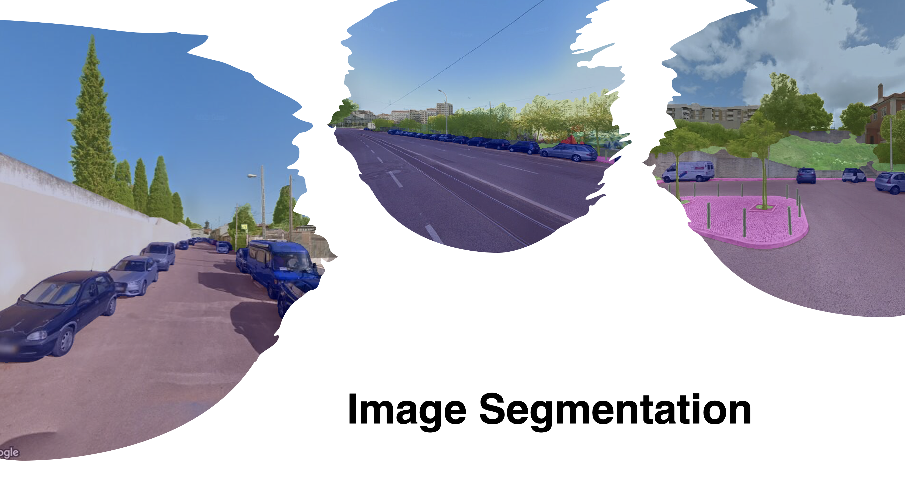

## CycleAI

Perception of risk impedes people from cycling. We aim to build an AI model that automatically estimates a score of perceived safety based on objects in an image. Using Google Street View, a complete map of safety will be affordably created for entire cities, enhancing urban planning and policies.

 

 &nbsp;&nbsp;&nbsp;&nbsp;

 &nbsp;&nbsp;&nbsp;&nbsp;

